

  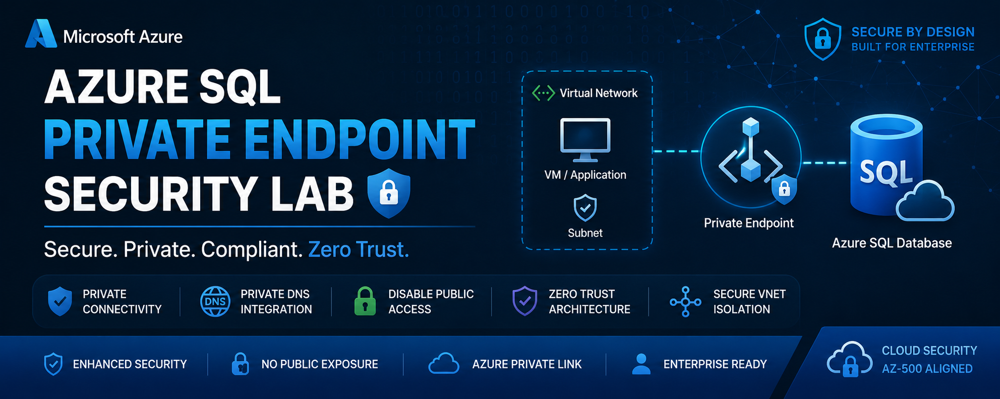

<h1 align="center">🔐 Azure SQL Private Endpoint Security Lab</h1>

<h3 align="center">
Secure Azure SQL Database Access Using Private Endpoint & Private DNS Integration
</h3>

  
  
  
  
  

---

# 📌 Project Overview

This lab demonstrates how to secure an Azure SQL Database using:

- Azure Private Endpoint
- Private DNS Zone Integration
- Virtual Network Isolation
- Public Network Access Restriction
- Internal VNet-Based Connectivity

The primary objective of this lab was to implement a **Zero Trust network architecture** by ensuring Azure SQL traffic remains private and does not traverse the public internet.

---

# 🏗️ Architecture Flow

  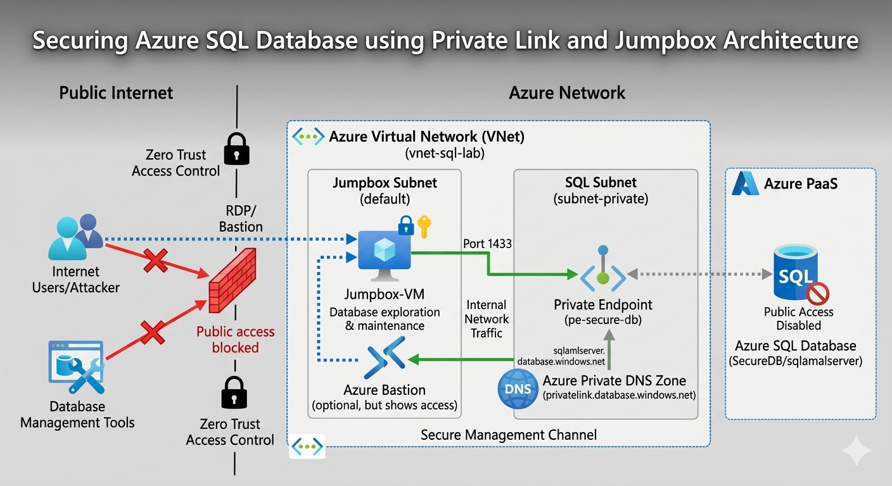

---

# 🎯 Security Objectives

✅ Eliminate public SQL exposure  
✅ Secure database communication over private networking  
✅ Implement Azure Private Link architecture  
✅ Restrict SQL access using VNet integration  
✅ Apply enterprise-style Azure SQL security controls  

---

# ☁️ Technologies Used

| Technology | Purpose |
|---|---|
| Azure SQL Database | Managed relational database |
| Azure Private Endpoint | Secure private connectivity |
| Azure Private DNS Zone | Internal DNS resolution |
| Azure Virtual Network | Network isolation |
| Azure VM | Internal testing client |
| Azure RBAC | Access management |
| Azure Policy | Governance enforcement |

---

# 🚀 Step 1 — Create Azure SQL Server

Created a secure Azure SQL logical server using SQL authentication.

  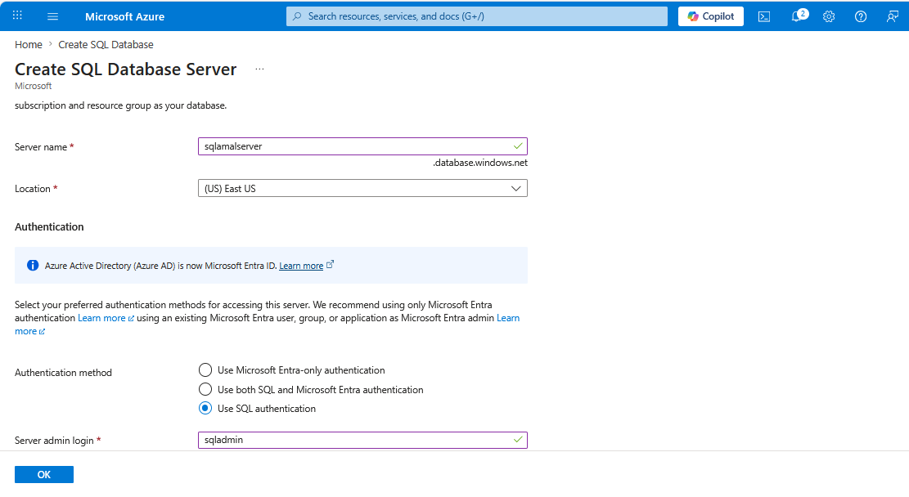

---

# 🔐 Step 2 — Configure SQL Authentication

Configured administrative credentials securely for SQL database management.

  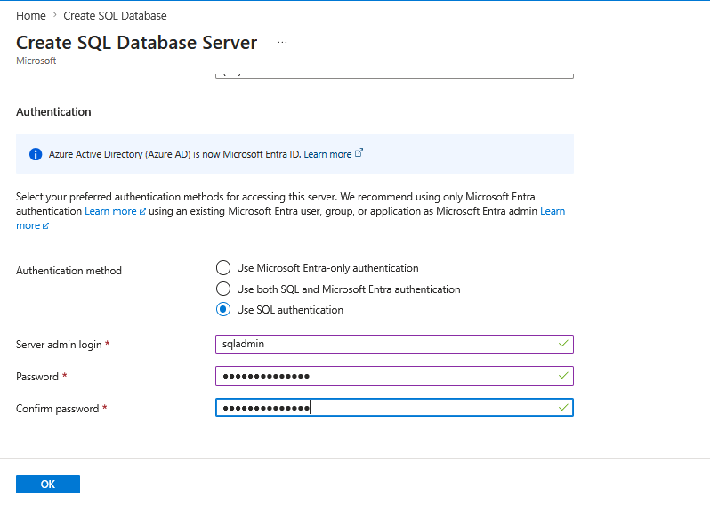

---

# 💾 Step 3 — Configure SQL Database Tier

Configured a budget-friendly Standard S0 database tier for secure testing and lab deployment.

  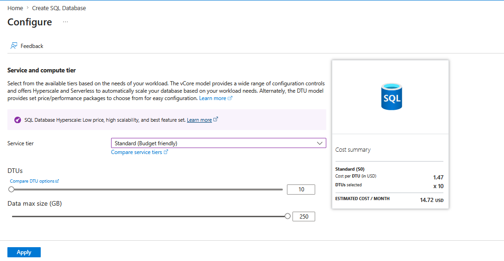

---

# 🌐 Step 4 — Create Virtual Network

Created a dedicated Azure Virtual Network to isolate internal communication between resources.

  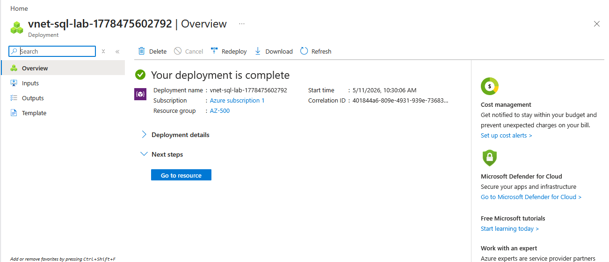

---

# 🔒 Step 5 — Create Private Endpoint

Configured Azure Private Endpoint to securely connect Azure SQL Database to the Virtual Network.

  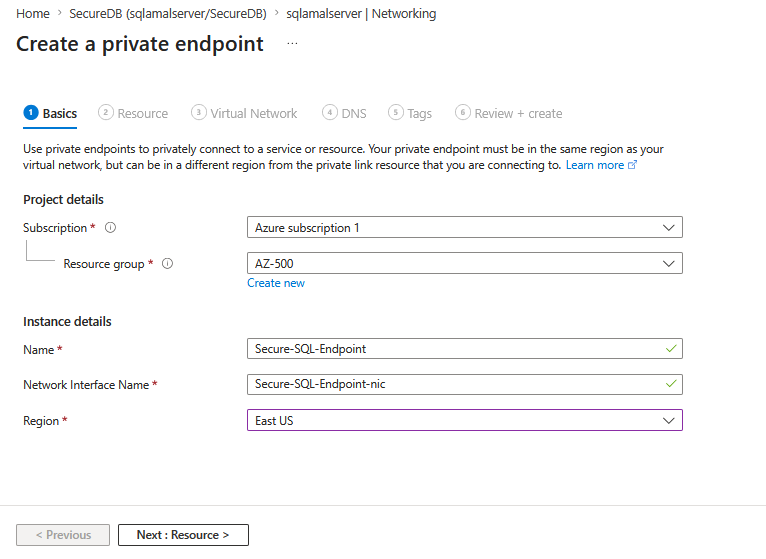

---

# 🧠 Step 6 — Configure Private DNS Integration

Integrated Azure Private DNS Zone to enable private name resolution for the SQL database.

  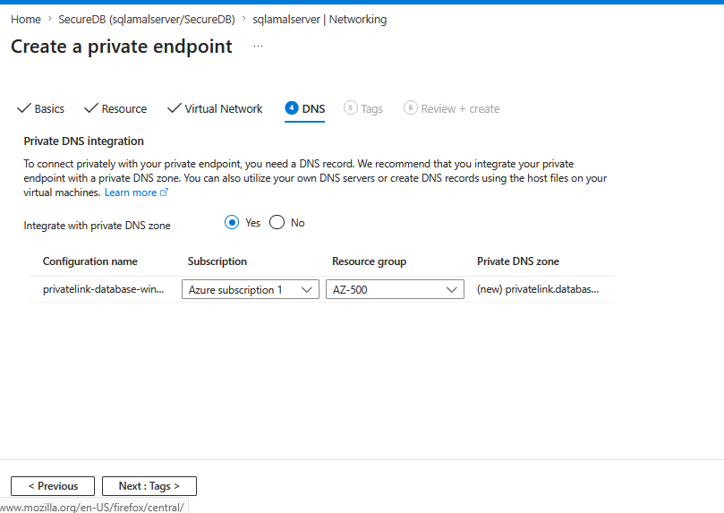

---

# 🖥️ Step 7 — Configure Internal VM Connectivity

Created an Azure Virtual Machine within the same VNet for internal secure connectivity testing.

  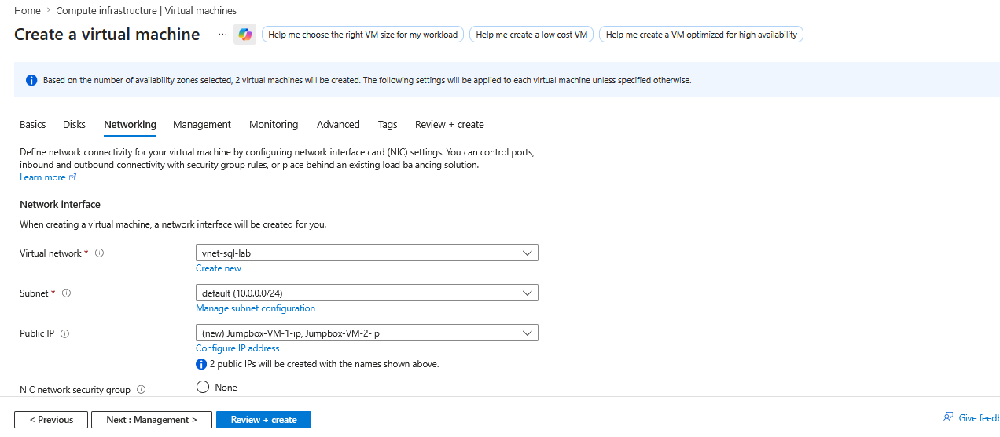

---

# 🔐 Step 8 — Disable Public Network Access

Public SQL access was disabled to enforce private-only connectivity.

This is a critical Zero Trust security control.

  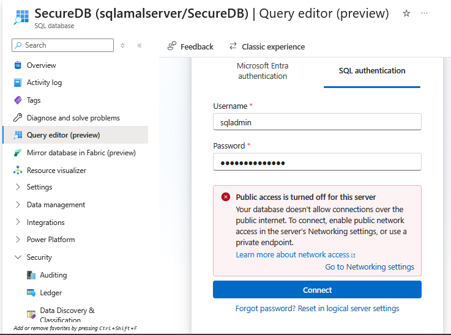

---

# ✅ Step 9 — Validate Internal Private Connectivity

Successfully validated internal SQL connectivity through private networking.

  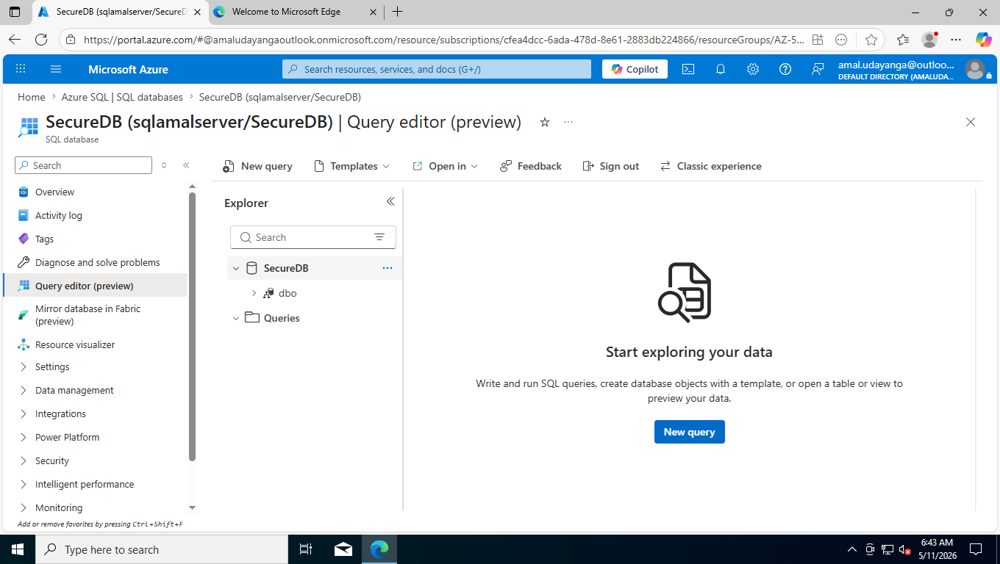

---

# 📊 SQL Database Overview

Azure SQL Database successfully deployed and secured using Private Endpoint architecture.

  

---

# 🔐 Private Endpoint Deployment Status

Azure Private Endpoint deployment completed successfully with DNS integration.

  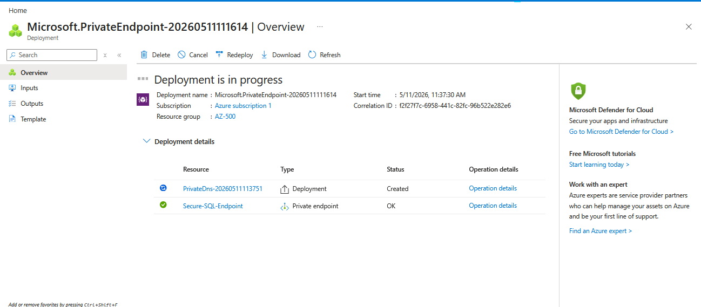

---

# 🌐 Private Network Configuration

Private networking configuration used to isolate Azure SQL communication from public exposure.

  

---

# 🛡️ Key Security Concepts Learned

| Concept | Description |
|---|---|
| Private Endpoint | Provides private IP connectivity to Azure SQL |
| Private DNS | Enables internal DNS resolution |
| Zero Trust | Removes unnecessary public exposure |
| Network Isolation | Restricts communication within VNet |
| Public Access Restriction | Blocks internet-based SQL access |
| Azure SQL Security | Enterprise-grade database protection |

---

# 🚨 Real-World Security Benefits

✅ Prevents public SQL exposure  
✅ Reduces attack surface  
✅ Supports enterprise compliance requirements  
✅ Enables secure hybrid/cloud architectures  
✅ Strengthens Zero Trust implementation  

---

# 📚 AZ-500 Skills Covered

- Azure SQL Security
- Private Endpoint Configuration
- Private DNS Integration
- Virtual Network Security
- Zero Trust Architecture
- Network Isolation
- Azure Resource Security

---

# 🧠 Key Takeaway

This lab demonstrated how Azure Private Endpoint can significantly improve Azure SQL security by ensuring all communication remains private within Azure networking infrastructure.

Instead of exposing SQL databases to the public internet, organizations can enforce secure internal-only communication using Private Link architecture.

---

# 🚀 Future Improvements

- Integrate NSGs for subnet-level filtering
- Enable Microsoft Defender for SQL
- Implement Azure Policy enforcement
- Add Managed Identity authentication
- Configure SQL Auditing & Threat Detection

---

# 👨‍💻 Author

## Amal Udayanga Basnayake

🔗 LinkedIn:  
https://www.linkedin.com/in/amal-udayanga-basnayake/

💻 GitHub:  
https://github.com/AmalUBasnayake

🌐 Portfolio:  
https://amalcyberlab.vercel.app/

---

# ⭐ If you found this project useful

Consider giving this repository a ⭐ and connecting with me on LinkedIn.

---

#AZ500 #Azure #CloudSecurity #CyberSecurity #AzureSQL #PrivateEndpoint #ZeroTrust #MicrosoftAzure #AzureSecurity #NetworkSecurity #CloudEngineer #SIEM #MicrosoftSentinel
